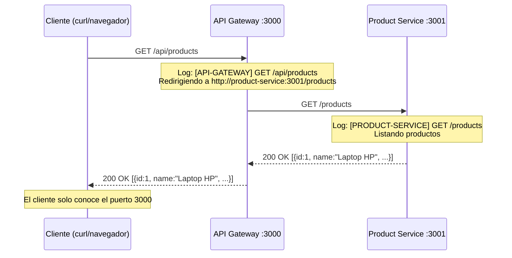

# API Gateway con NestJS — Investigación II

Proyecto académico que implementa un **API Gateway** funcional usando NestJS, Docker y Docker Compose, demostrando cómo dos servicios se comunican y coordinan a través de un punto de entrada único.

---

## 1. Integrantes del equipo

| #  | Nombre | Rol |
|----|--------|-----|
| 1  | Jairo Jose Silva Martinez | _[Rol]_ |
| 2  | Daniel Emilio Elizondo Gutierrez | _[Rol]_ |
| 3  | Andrey Gonzalez | _[Rol]_ |

> Reemplaza los roles con los de tu equipo.

---

## 2. Tema

**TEMA: API Gateway**

- **Tecnología:** NestJS (framework de Node.js)
- **Infraestructura:** Docker + Docker Compose
- **Servicios:** API Gateway (puerto 3000) + Product Service (puerto 3001)

---

## 3. ¿Qué es un API Gateway?

### Explicación con palabras propias

Un **API Gateway** es un servidor que funciona como la **puerta de entrada única** a un conjunto de servicios internos. En lugar de que cada cliente (navegador, app móvil, otro sistema) conozca la dirección y el puerto de cada microservicio, todos envían sus peticiones al Gateway, y él se encarga de **redirigir (hacer proxy de)** cada petición al servicio correspondiente, registrar lo que pasa y devolver la respuesta al cliente.

### Analogía simple

> Imagina un **hotel**: los huéspedes (clientes) nunca entran directamente a la cocina, la lavandería o recepción de atrás; se dirigen al **recepcionista** (el API Gateway). Él los escucha, sabe a qué departamento enviarlos, anota su visita en un libro de registro (logs) y les devuelve el resultado. Un solo punto de contacto para todo el hotel.

---

## 4. ¿Qué problema resuelve?

### Situación real donde tiene sentido

Una tienda online tiene varios servicios: productos, usuarios, pagos y notificaciones. Si cada cliente (web, app Android, app iOS) llamara directamente a los 4 servicios, habría que:

- Repetir en cada cliente la lógica de autenticación, rate limiting y logs.
- Cambiar todos los clientes si un servicio cambia de puerto o URL.
- Controlar quién accede a qué de forma dispersa.

Con un **API Gateway**, los clientes solo conocen `http://gateway`. El Gateway centraliza:

1. **Punto de entrada único** — una sola URL para todo.
2. **Enrutamiento** — redirige `/api/users` a users-service, `/api/products` a product-service, etc.
3. **Observabilidad** — cada petición queda registrada (método, URL, timestamp, tiempo de respuesta).
4. **Manejo de errores** — si un servicio cae, responde de forma controlada (503) sin exponer detalles internos.

Este proyecto demuestra exactamente eso con **2 servicios**: el cliente solo conoce el puerto `3000`, pero los datos reales provienen del `product-service:3001`.

---

## 5. ¿Cómo funciona?

### Diagrama de flujo (Mermaid)



### Diagrama ASCII

```
                 ┌─────────────────────────────────────────────┐
                 │              RED DOCKER                     │
                 │         api-gateway-network                 │
                 │                                             │
  Cliente        │   ┌──────────────┐    HTTP     ┌────────────┴───┐
 (solo conoce    │   │  API GATEWAY │ ──────────► │ PRODUCT SERVICE│
  el puerto      │──►│   :3000      │ ◄────────── │    :3001       │
  3000)          │   │  (proxy +    │  respuesta  │  (CRUD en      │
                 │   │   logs)      │             │   memoria)     │
                 │   └──────────────┘             └────────────────┘
                 └─────────────────────────────────────────────┘
```

### Explicación paso a paso

1. El cliente envía `GET http://localhost:3000/api/products` **solo conociendo el puerto 3000**.
2. El **API Gateway** recibe la petición, la registra en su log y calcula el destino: `http://product-service:3001/products`.
3. El Gateway reenvía la petición (proxy) al **Product Service** usando `HttpService` de `@nestjs/axios`.
4. El **Product Service** ejecuta la operación (listar, crear, etc.), registra su propio log y responde en JSON.
5. El Gateway mide el tiempo de respuesta, devuelve la respuesta del microservicio al cliente y cierra el ciclo en sus logs.

---

## 6. Arquitectura del proyecto

### Diagrama de componentes

```mermaid
graph TB
    subgraph Cliente
        C[curl / Navegador]
    end

    subgraph "Docker: api-gateway-network"
        subgraph api-gateway["api-gateway :3000"]
            GC[GatewayController<br/>/api/*]
            GS[GatewayService<br/>proxy + logs]
            TI[TimingInterceptor<br/>tiempo de respuesta]
            HM[HttpModule<br/>@nestjs/axios]
        end

        subgraph product-service["product-service :3001"]
            PC[ProductsController<br/>/products, /health]
            PS[ProductsService<br/>CRUD en memoria]
            DTO[DTOs + class-validator]
        end
    end

    C -->|HTTP :3000| GC
    GC --> TI
    GC --> GS
    GS --> HM
    HM -->|HTTP :3001| PC
    PC --> DTO
    PC --> PS
```

### Descripción de cada servicio

| Servicio | Puerto | Responsabilidad |
|----------|--------|-----------------|
| **api-gateway** | 3000 | Recibe todas las peticiones de los clientes, actúa como punto de entrada único, redirige (proxy) al microservicio correspondiente, registra cada petición y mide el tiempo de respuesta. |
| **product-service** | 3001 | Gestiona el CRUD de productos en memoria (sin base de datos), valida la entrada con DTOs y devuelve respuestas JSON. |

---

## 7. Ventajas y desventajas

### Ventajas (mínimo 5)

1. **Punto de entrada único** — el cliente solo necesita conocer una URL/puerto.
2. **Desacoplamiento** — los servicios pueden cambiar de dirección o dividirse sin tocar a los clientes.
3. **Observabilidad centralizada** — todos los logs y tiempos de respuesta pasan por un solo lugar.
4. **Seguridad** — se pueden aplicar autenticación, rate limiting y validación antes de llegar a los microservicios.
5. **Manejo uniforme de errores** — traduce fallas internas (503, timeouts) en respuestas consistentes.
6. **Simplificación del cliente** — no necesita lógica de enrutamiento entre múltiples servicios.

### Desventajas (mínimo 5)

1. **Punto único de fallo** — si el Gateway cae, todos los servicios quedan inaccesibles.
2. **Latencia adicional** — cada petición atraviesa un salto HTTP extra.
3. **Complejidad operativa** — hay un componente más que configurar, monitorear y escalar.
4. **Acoplamiento al Gateway** — un bug en el proxy puede afectar a todos los servicios.
5. **Sobrecarga de red** — el tráfico se duplica (cliente→Gateway→servicio).
6. **Cuello de botella potencial** — sin escalar horizontalmente el Gateway, limita el throughput total.

### Cuándo usarlo

- Microservicios con múltiples consumidores (web, móvil, terceros).
- Cuando necesitas autenticación/rate limiting centralizado.
- Cuando los servicios cambian frecuentemente de ubicación o versión.

### Cuándo NO usarlo

- Aplicaciones monolíticas pequeñas o prototipos con un solo servicio.
- Sistemas con requisitos de latencia ultra-baja (tiempo real, gaming).
- Cuando el equipo no puede operar/monitorear un componente adicional crítico.

---

## 8. Tecnologías utilizadas

| Tecnología | Versión / base | Uso en el proyecto |
|------------|----------------|--------------------|
| **NestJS** | v11 | Framework para ambos servicios (gateway y productos), con módulos, controladores y servicios. |
| **@nestjs/axios** | v3 | `HttpModule`/`HttpService` para hacer las peticiones proxy desde el gateway. |
| **@nestjs/config** | v4 | Lectura de variables de entorno (`PRODUCT_SERVICE_URL`, `PORT`). |
| **class-validator / class-transformer** | — | Validación de DTOs (`CreateProductDto`, `UpdateProductDto`). |
| **@nestjs/swagger** | v11 | Documentación interactiva en `/docs` (opcional pero recomendada). |
| **Docker** | node:22-alpine | Contenedores con multi-stage build (build + producción). |
| **Docker Compose** | v2 | Orquestación de ambos servicios con red interna y healthchecks. |

### Alternativas consideradas

| Alternativa | Tipo | Por qué no se usó |
|-------------|------|--------------------|
| **Traefik** | Gateway de proceso (infra) | Muy potente con labels de Docker, pero no es NestJS ni permite lógica de negocio en TypeScript. |
| **Kong** | Gateway completo (open source) | Pensado para producción a gran escala; excesivo para una investigación académica. |
| **NGINX como reverse proxy** | Proxy de infraestructura | No permite lógica personalizada (logs de negocio, interceptores) sin scripting Lua/JS. |
| **AWS API Gateway** | Gateway gestionado (cloud) | Es un servicio cloud de pago; el objetivo es una solución local y reproducible. |

> **Decisión:** NestJS + `@nestjs/axios` porque el objetivo es demostrar el patrón de API Gateway **aplicando programación** (logs, interceptores, manejo de errores en TypeScript), no solo configuración de infraestructura.

---

## 9. Cómo ejecutar el proyecto

### Requisitos previos

- [Docker Desktop](https://www.docker.com/products/docker-desktop/) instalado y **corriendo**
- (Opcional) Node.js 22+ solo si quieres compilar los servicios sin Docker
- `curl` o un navegador para probar los endpoints

### Opción A — Script automático (recomendado)

**Windows (PowerShell):**

```powershell
.\run.ps1
```

**Linux / Mac (bash):**

```bash
chmod +x run.sh
./run.sh
```

El script: verifica Docker → detiene contenedores previos → construye imágenes → levanta los servicios → espera → muestra estado y URLs.

### Opción B — Comandos manuales

```bash
# 1. (Opcional) crear tu .env desde la plantilla
cp .env.example .env

# 2. Levantar todo
docker compose up -d --build

# 3. Ver el estado
docker compose ps

# 4. Ver los logs
docker compose logs -f

# 5. Detener todo
docker compose down
```

---

## 10. Cómo probar el escenario

### Comandos curl de ejemplo

```bash
# 1. Verificar que el API Gateway está vivo
curl http://localhost:3000/api/health
# → {"status":"ok","service":"api-gateway",...}

# 2. Verificar que el Product Service está vivo
curl http://localhost:3001/health
# → {"status":"ok","service":"product-service",...}

# 3. Listar productos A TRAVÉS DEL GATEWAY
curl http://localhost:3000/api/products
# → [{"id":1,"name":"Laptop HP",...},{"id":2,...},{"id":3,...}]

# 4. Obtener un producto específico
curl http://localhost:3000/api/products/1
# → {"id":1,"name":"Laptop HP","description":"Laptop 15 pulgadas","price":800,...}

# 5. Crear un producto
curl -X POST http://localhost:3000/api/products \
  -H "Content-Type: application/json" \
  -d '{"name":"Monitor Samsung","description":"Monitor 24 pulgadas","price":250,"stock":15}'
# → {"id":4,"name":"Monitor Samsung",...}

# 6. Actualizar un producto
curl -X PUT http://localhost:3000/api/products/1 \
  -H "Content-Type: application/json" \
  -d '{"name":"Laptop HP Actualizada","price":850}'
# → {"id":1,"name":"Laptop HP Actualizada","price":850,...}

# 7. Eliminar un producto
curl -X DELETE http://localhost:3000/api/products/3
# → {"deleted":true,"id":3,"message":"Producto eliminado"}
```

> 💡 Todos los endpoints se disparan desde el **gateway** (`/api/*`, puerto 3000). El Product Service
> también se puede llamar directo por el 3001 solo para comparar.

### Probar con la interfaz web (opcional pero recomendado)

Abre **http://localhost:3000/** en el navegador. La página es un cliente HTML que:

1. Llama **solo al gateway** (`/api/*`, puerto 3000) — el navegador nunca ve el puerto 3001.
2. Muestra la **bitácora de cada petición** (método, ruta, estado HTTP y tiempo de respuesta).
3. Permite ejecutar listar, obtener, crear, actualizar y eliminar sin usar `curl`.

En paralelo, observa los logs para ver la comunicación real entre servicios:

```bash
docker compose logs -f api-gateway      # → "Redirigiendo a http://product-service:3001/..."
docker compose logs -f product-service  # → "GET /products - Listando productos"
```

### URLs para probar en el navegador

| URL | Descripción |
|-----|-------------|
| http://localhost:3000/ | **Interfaz web de demostración** (HTML/CSS/JS servida por el gateway) |
| http://localhost:3000/api/health | Salud del Gateway |
| http://localhost:3000/api/products | Lista de productos **vía Gateway** |
| http://localhost:3000/api/products/1 | Producto con id 1 |
| http://localhost:3000/docs | Swagger del Gateway |
| http://localhost:3001/health | Salud directa del Product Service |
| http://localhost:3001/products | Lista de productos **directa** (comparar) |

### Capturas esperadas (salida de ejemplo)

**GET /api/products (respuesta JSON):**

```json
[
  {
    "id": 1,
    "name": "Laptop HP",
    "description": "Laptop 15 pulgadas",
    "price": 800,
    "stock": 10,
    "createdAt": "2026-01-15T10:30:45.123Z"
  },
  {
    "id": 2,
    "name": "Mouse Logitech",
    "description": "Mouse inalámbrico",
    "price": 25,
    "stock": 50,
    "createdAt": "2026-01-15T10:30:45.123Z"
  },
  {
    "id": 3,
    "name": "Teclado Mecánico",
    "description": "Teclado RGB",
    "price": 120,
    "stock": 30,
    "createdAt": "2026-01-15T10:30:45.123Z"
  }
]
```

**POST con datos inválidos (validación de DTO):**

```json
{
  "statusCode": 400,
  "message": ["El nombre es obligatorio", "La descripción es obligatoria"],
  "error": "Bad Request"
}
```

---

## 11. Estructura del proyecto

```
Investigacion2Definitivo/
├── api-gateway/                  ← Servicio 1: API Gateway
│   ├── src/
│   │   ├── main.ts
│   │   ├── app.module.ts
│   │   └── gateway/
│   │       ├── gateway.controller.ts
│   │       ├── gateway.service.ts
│   │       ├── gateway.module.ts
│   │       ├── timing.interceptor.ts
│   │       └── dto/
│   │           ├── create-product.dto.ts
│   │           └── update-product.dto.ts
│   ├── public/                     ← Interfaz web de demostración (HTML/CSS/JS)
│   ├── package.json
│   ├── tsconfig.json
│   ├── tsconfig.build.json
│   ├── nest-cli.json
│   ├── Dockerfile
│   └── .dockerignore
│
├── product-service/              ← Servicio 2: Microservicio de Productos
│   ├── src/
│   │   ├── main.ts
│   │   ├── app.module.ts
│   │   └── products/
│   │       ├── products.controller.ts
│   │       ├── products.service.ts
│   │       ├── products.module.ts
│   │       └── dto/
│   │           ├── create-product.dto.ts
│   │           └── update-product.dto.ts
│   ├── package.json
│   ├── tsconfig.json
│   ├── tsconfig.build.json
│   ├── nest-cli.json
│   ├── Dockerfile
│   └── .dockerignore
│
├── docker-compose.yml            ← Orquestación de ambos servicios
├── .env                          ← Variables de entorno
├── .env.example                  ← Plantilla de variables
├── run.ps1                       ← Script de ejecución (Windows)
├── run.sh                        ← Script de ejecución (Linux/Mac)
└── README.md                     ← Este documento
```

---

## 12. Flujo de comunicación

### Explicación detallada

1. **El cliente elige el Gateway.** Toda petición empieza en `http://localhost:3000/api/...`. El cliente ignora por completo que existe un servicio en el puerto 3001.

2. **El Gateway recibe y registra.** El `GatewayController` recibe la petición. El `TimingInterceptor` toma la hora de inicio, y el `GatewayService` registra el log de redirección:

   ```
   [API-GATEWAY] 2026-01-15 10:30:45 - GET /api/products - Redirigiendo a http://product-service:3001/products
   ```

3. **Resolución de la URL destino.** El `GatewayService` lee `PRODUCT_SERVICE_URL` desde `.env` con `ConfigService` (por defecto `http://product-service:3001`, el **nombre del servicio en la red de Docker**, no `localhost`).

4. **Proxy HTTP.** Con `HttpService` (`@nestjs/axios`) se reenvía la petición: método, body y headers. `firstValueFrom` convierte el `Observable` en promesa.

5. **El Product Service procesa.** El `ProductsController` valida el body con los DTOs (`class-validator`) y delega en `ProductsService`, que opera sobre el array en memoria y registra su log:

   ```
   [PRODUCT-SERVICE] 2026-01-15 10:30:45 - GET /products - Listando productos
   ```

6. **La respuesta regresa.** El servicio responde JSON → el Gateway mide la duración (`Tiempo de respuesta: Xms`) y devuelve la respuesta al cliente.

7. **Errores traducidos.** Si el microservicio responde 4xx/5xx, el Gateway reenvía ese estado. Si no responde (caído), el Gateway devuelve `503 Service Unavailable` sin filtrar detalles internos.

### Comunicación por nombre de servicio

Docker Compose crea la red `api-gateway-network`. Dentro de ella, `api-gateway` resuelve `product-service` por **nombre de servicio** (DNS interno de Docker), no por IP:

```
PRODUCT_SERVICE_URL=http://product-service:3001
```

---

## 13. Logs y evidencia

### Cómo ver los logs

```bash
# Todos los servicios
docker compose logs -f

# Solo el API Gateway
docker compose logs -f api-gateway

# Solo el Product Service
docker compose logs -f product-service

# Últimas 100 líneas
docker compose logs --tail=100
```

### Qué buscar en ellos

**Evidencia 1 — El Gateway redirige (comunicación saliente):**

```
[API-GATEWAY] 2026-01-15 10:30:45 - GET /api/products - Redirigiendo a http://product-service:3001/products
```

**Evidencia 2 — El Product Service recibe y procesa (comunicación entrante):**

```
[PRODUCT-SERVICE] 2026-01-15 10:30:45 - GET /products - Listando productos
[PRODUCT-SERVICE] 2026-01-15 10:30:46 - POST /products - Creando producto: Monitor Samsung
```

**Evidencia 3 — Tiempo de respuesta medido por el interceptor:**

```
[API-GATEWAY] 2026-01-15 10:30:45 - GET /api/products - Tiempo de respuesta: 12ms
```

**Evidencia 4 — Salud de los contenedores (healthchecks de Docker):**

```bash
docker compose ps
# NAME               STATUS                    PORTS
# api-gateway        Up (healthy)              0.0.0.0:3000->3000/tcp
# product-service    Up (healthy)              0.0.0.0:3001->3001/tcp
```

### Demostración en clase (checklist)

1. Ejecutar `.\run.ps1` y mostrar el levantamiento con healthchecks.
2. Abrir **http://localhost:3000/** → mostrar la interfaz web (7.1) con los logs abiertos.
3. En la interfaz: listar, crear, actualizar y eliminar productos **solo vía el gateway**.
4. Mostrar en paralelo `docker compose logs -f api-gateway` y `docker compose logs -f product-service` para evidenciar que la comunicación ocurrió (quién inicia → qué se transmite → qué servicio la procesa).
5. `curl http://localhost:3000/api/products` → responde el Product Service **sin que el cliente conozca el 3001**.

---

## 14. Criterios de evaluación — cobertura

| # | Criterio | Dónde está cubierto |
|---|----------|---------------------|
| 1 | Investigación y comprensión del concepto (1%) | Secciones 3–5 de este README |
| 2 | Implementación funcional con 2+ servicios (1.5%) | `api-gateway/` + `product-service/` |
| 3 | Dockerfiles, Docker Compose e infraestructura reproducible (1%) | Multi-stage builds + healthchecks + `docker compose up -d` |
| 4 | Repositorio, script de ejecución y documentación (0.5%) | `run.ps1`, `run.sh`, este `README.md` |
| 5 | Explicación y demostración en clase (1%) | Sección 13 (logs claros, endpoints, diagramas) |

---

## Licencia

Proyecto académico — Investigación II. Uso educativo.
